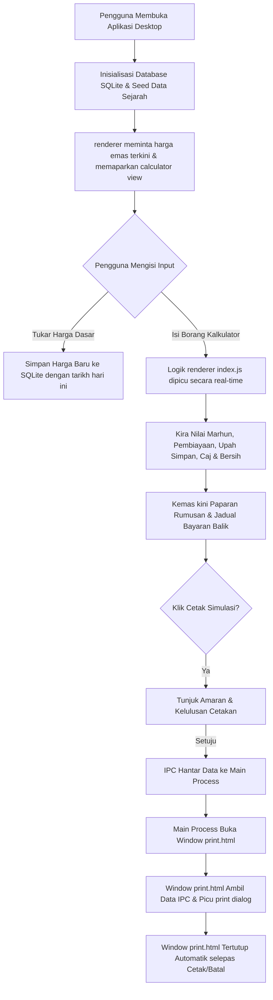

# Dokumen Keperluan Produk (PRD) - Kalkulator Ar Rahnu V2 (Desktop Edition)

Dokumen Keperluan Produk (PRD) ini menyediakan spesifikasi lengkap untuk **Kalkulator Ar Rahnu (Versi 2 - Desktop Edition)**. Dokumen ini menerangkan seni bina desktop, pangkalan data, saluran komunikasi IPC, peraturan perniagaan, logik pengiraan, dan reka bentuk sistem bagi memudahkan rujukan oleh pembangun atau AI di masa hadapan.

---

## 1. Pengenalan & Latar Belakang

Kalkulator Ar Rahnu Desktop ialah sebuah aplikasi desktop (perisian) serasi Windows yang dibangunkan menggunakan Electron, HTML, CSS, dan JavaScript, disokong oleh pangkalan data SQLite. Perisian ini direka untuk kegunaan 100% offline dan tahan sekatan firewall pejabat yang ketat (tiada sebarang panggilan ke CDN luaran pada waktu runtime).

### Objektif Utama
- Membantu kakitangan dalaman menilai emas, mengira margin pembiayaan, dan menyemak upah simpan serta potongan secara masa-nyata (real-time).
- Menyediakan simulasi jadual bayaran balik berfasa (Fasa 1 Asas & Fasa 2 Lanjutan).
- Menyediakan Kalkulator Belian Emas bersepadu untuk transaksi belian balik emas semasa mengikut mutu emas.
- Menyediakan draf cetakan resit (slip simulasi) tidak rasmi bagi kedua-dua Ar Rahnu dan belian balik emas.
- Menyimpan dan memaparkan sejarah perubahan harga emas kaunter.

### Ciri-ciri Utama & Had Rangkaian
- **Seni Bina Electron (Main & Renderer Process)**: Memisahkan logik backend (Main Process) seperti SQLite dan window management dengan paparan UI (Renderer Process) secara selamat melalui `preload.js` bridge.
- **100% Offline (Bebas CDN)**: Font Google Fonts Outfit dimuat turun secara fizikal (.woff2) dan disimpan setempat bersama pustaka Chart.js (UMD) pada waktu pemasangan. Tiada talian internet diperlukan semasa perisian dijalankan.
- **Penyimpanan SQLite Tempatan**: Menggunakan pangkalan data `better-sqlite3` untuk merekod dan memanggil semula harga emas mengikut tarikh kemaskini.

---

## 2. Struktur Pengguna & Antara Muka (UI/UX)

Antara muka perisian dibina menggunakan tema premium **Gelap & Emas** yang disesuaikan untuk aplikasi desktop profesional dengan warna berikut:
- **Primary/Gold**: `#d4af37` (Gold) / `#e8c547` (Light Gold)
- **Background Main**: `#0c0e12` (Extra Dark)
- **Background Panel**: `#12161f` (Dark Charcoal)
- **Card Background**: `#1b202c` (Slate Gray)
- **Text Main**: `#f3f4f6`
- **Text Muted**: `#9ca3af`
- **Danger**: `#ef4444`
- **Success**: `#10b981`

### Susun Atur Menu & Panel (Sidebar Layout)
Perisian dibahagikan kepada sidebar navigasi kiri dan panel kandungan utama di sebelah kanan:
1. **Sidebar Navigasi**: Menu bertukar panel:
   - **Kalkulator Ar Rahnu**: Simulasi pembiayaan gadaian.
   - **Kalkulator Belian**: Simulasi belian balik emas (trade-in/purchase) dengan sokongan Multi-Tab (sehingga 10 tab).
   - **Kalkulator Al Saleem**: Simulasi simpanan selamat emas tanpa pembiayaan dengan sokongan Multi-Tab (sehingga 10 tab).
   - **Graf Sejarah**: Memaparkan trend harga emas (999 dan 916) dan jadual sejarah.
   - **Urus Harga Emas**: Menukar harga emas semasa kaunter and merekodnya ke SQLite.
   - **Panduan**: Manual produk dan logik pengiraan.
2. **Kalkulator Lajur Berkembar (Real-Time)**:
   - **Kalkulator Ar Rahnu**:
     - **Lajur Kiri**: Input produk, barang kemas (mutu & berat), tebus surat lama, dan caj tambahan.
     - **Lajur Kanan (Sticky)**: Rumusan Pembiayaan Baru dan Jadual Bayaran Balik.
   - **Kalkulator Belian Emas**:
     - **Lajur Kiri**: Input dinamik barang belian emas (mutu & berat) dengan sokongan tab.
     - **Lajur Kanan (Sticky)**: Rumusan Belian Emas bertable (BIL, Mutu, Berat, Harga Semasa, Harga Belian/g, Nilai Marhun, Nilai Belian) dan butang cetak.
   - **Kalkulator Al Saleem**:
     - **Lajur Kiri**: Input dinamik barang simpanan Al Saleem (mutu & berat) dan tarikh mula/tebus dengan sokongan tab.
     - **Lajur Kanan (Sticky)**: Rumusan Simpanan Al Saleem bertable (BIL, Mutu, Berat, Harga Semasa, Nilai Marhun, Upah Simpan/Hari) serta simulasi kadar upah simpan terkumpul dan butang cetak.
3. **Graf Trend Emas**: Menggunakan Chart.js tempatan untuk melukis garisan pergerakan harga emas bagi mutu 999 dan 916 sahaja berdasarkan tarikh rekod SQLite.

---

## 3. Pangkalan Data SQLite (`better-sqlite3`)

Pangkalan data fail setempat `ar_rahnu_v2.db` disimpan di dalam folder data aplikasi pengguna (`app.getPath('userData')`).

### Skema Jadual `gold_prices`
```sql
CREATE TABLE IF NOT EXISTS gold_prices (
    id INTEGER PRIMARY KEY AUTOINCREMENT,
    date TEXT NOT NULL,         -- Format: YYYY-MM-DD
    grade TEXT NOT NULL,        -- Cth: '999', '950', '916', '875', '835', '750', '700 WG', '750 WG'
    price REAL NOT NULL,        -- Harga dasar segram (RM)
    UNIQUE(date, grade)
);
```

### Logik Harga Emas Lalai & Pembenihan (Seeding)
Harga dasar permulaan (default) dalam RM/gram:
- **999**: 616.00 | **950**: 586.00 | **916**: 565.00 | **875**: 540.00
- **835**: 515.00 | **750**: 463.00 | **700 WG**: 432.00 | **750 WG**: 451.00

*Rutin Seeding*: Jika database kosong ketika perisian dibuka buat pertama kali, perisian akan membina data sejarah 15 hari ke belakang berdasarkan harga dasar di atas dengan variasi kecil matematik (`Math.sin()`) bagi membolehkan graf sejarah mempunyai data trend awal yang cantik.

---

## 4. Logik Perniagaan & Pengiraan (Core Calculations)

### A. Pengiraan Nilai Marhun (Valuation)
Untuk setiap barang kemas $i$ yang dimasukkan:
$$\text{Marhun}_i = \text{Berat}_i \times \text{Harga Emas Semasa}_i$$
$$\text{Jumlah Marhun} = \sum \text{Marhun}_i$$
$$\text{Jumlah Berat} = \sum \text{Berat}_i$$

*Nota: Berat mesti bernilai $> 0$ untuk dikira.*

### B. Jumlah Pembiayaan Baru (Financing Amount)
Menggunakan margin daripada produk terpilih. Nilai akhir di**bundarkan ke bawah kepada Ringgit terdekat (buang sen)**:
$$\text{financingRaw} = \text{Jumlah Marhun} \times \frac{\text{Margin Produk (\%)}}{100}$$
$$\text{financingAmount} = \lfloor \text{financingRaw} \rfloor$$

Pengguna boleh menukar amaun ini secara manual ke nilai yang lebih rendah, di mana ia akan dibundarkan ke bawah tanpa sen.

### C. Upah Simpan Sehari & Awal (Storage Fee)
Kadar upah simpan harian dihitung berdasarkan jenis kadar produk:
1. **Kadar Bulanan Standard** (Prestij, Didik, Bisnes, Biznita, Emas, Care):
   $$\text{dailyRateFactor} = \frac{\text{Kadar Upah Simpan Bulanan (\%)}}{100} \times \frac{12}{365}$$
2. **Kadar Bulanan Rata (Kadar Khas)** (eKASIH (Kadar Khas)):
   Walaupun sebelum ini dikira harian, kini telah diselaraskan ke kadar bulanan (RM 0.10 / RM100 sebulan):
   $$\text{dailyRateFactor} = \frac{\text{Kadar Upah Simpan Bulanan (\%)}}{100} \times \frac{12}{365}$$

Selepas menentukan kadar harian, nilai upah harian dikira dan dibundarkan kepada 2 tempat perpuluhan:
$$\text{dailyRateRaw} = \text{Jumlah Marhun} \times \text{dailyRateFactor}$$
$$\text{dailyRate} = \text{round}(\text{dailyRateRaw} \times 100) / 100$$

Upah simpan awal sebanyak **60 hari** akan dipotong terus daripada pembiayaan baru pelanggan semasa pengeluaran:
$$\text{upah60Days} = \text{dailyRate} \times 60$$

### D. Caj Tambahan / Potongan (Deductions)
1. **I-Protect Takaful (Perlindungan Emas)** (Eksklusif pilih salah satu sahaja):
   - **I-Protect 1.0**:
     - Jika $\text{Jumlah Marhun} \le \text{RM } 1000$: Premium = RM 1.25
     - Jika $\text{Jumlah Marhun} > \text{RM } 1000$: Premium = $\lceil \text{Jumlah Marhun} / 1000 \rceil \times 1.25$
   - **I-Protect 2.0**:
     - Jika $\text{Jumlah Marhun} \le \text{RM } 1000$: Premium = RM 2.50
     - Jika $\text{Jumlah Marhun} > \text{RM } 1000$: Premium = $\lceil \text{Jumlah Marhun} / 1000 \rceil \times 2.50$
     - Tambahan Caj Transaksi tetap: **RM 1.50**
2. **Flexi PA**: Caj tetap **RM 64.80** jika ditandakan.
3. **Ahli Baru**: Caj tetap **RM 10.00** jika ditandakan.
4. **Caj Kehilangan SAG**: Caj tetap **RM 10.00** jika ditandakan.
5. **Caj Surat Wakil Tebus**: Caj tetap **RM 10.00** jika ditandakan.
6. **Cuci Emas** & **Uji Emas**: Input manual (RM).
7. **Lain-lain Caj Dinamik**: Jumlah daripada baris tambahan dinamik.

$$\text{totalDeductionsCommon} = \text{upah60Days} + \text{iProtect} + \text{iProtectTransFee} + \text{flexiPa} + \text{newMember} + \text{sag} + \text{suratWakilTebus} + \text{cuci} + \text{uji} + \text{othersTotal}$$

### E. Tunai Tambahan (Cash Additions / Cash In)
1. **Belian Emas (Tunai)**: Jumlah input manual (RM).
2. **Lain-lain Tunai Tambahan Dinamik**: Jumlah daripada baris dinamik tunai (lebihan lelong, pengeluaran simpanan khas).

### F. Tebus Surat Gadaian Lama (Redemption of Old Pawn Tickets)
$$\text{totalRedeemOld} = \sum \text{Jumlah Tebus Surat Lama}_i$$

### G. Jumlah Bersih Diterima & Defisit Tunai
$$\text{netReceivedStandard} = \text{financingAmount} + \text{belianEmas} + \text{otherCashTotal} - \text{totalDeductionsCommon} - \text{totalRedeemOld}$$

Sekiranya $\text{netReceivedStandard} < 0$:
- Berlaku situasi **Defisit** di mana pelanggan perlu menambah bayaran tunai di kaunter. Amaun defisit ialah $\text{deficit} = |\text{netReceivedStandard}|$.
- Perisian memaparkan input **Tunai Diterima (RM)** untuk mengira baki wang ubah:
  $$\text{change} = \text{cashPaid} - \text{deficit}$$
- Jika `cashPaid` kurang daripada `deficit`, memaparkan `"Tunai tidak mencukupi"`.

### H. Jadual Bayaran Balik (Repayment Schedule)
1. **Fasa 1: Tempoh Asas (6 Bulan / 180 Hari)**:
   - **Baki Upah Simpan Asas Wajib Bayar (120 Hari)**:
     $$\text{upahBasicBal} = \text{dailyRate} \times 120$$
   - **Jumlah Penebusan Bulan Ke-6**:
     $$\text{totalRedeemBasic} = \text{financingAmount} + \text{upahBasicBal}$$
   - **Ansuran Bulanan untuk Tebus (6 Bulan)**:
     $$\text{monthlySavings6} = \frac{\text{totalRedeemBasic}}{6}$$
2. **Fasa 2: Tempoh Lanjutan (2 + 2 Bulan / 120 Hari)** (Hanya untuk produk dengan `canExtend = true`):
   - **Syarat Lanjutan**: Jelaskan baki upah simpan asas ($\text{upahBasicBal}$) sebelum/pada tarikh tamat Fasa 1.
   - **Upah Simpan Lanjutan (120 Hari)**:
     $$\text{upahExtended} = \text{dailyRate} \times 120$$
   - **Jumlah Penebusan Bulan Ke-10**:
     $$\text{totalRedeemExtended} = \text{financingAmount} + \text{upahExtended}$$
   - **Ansuran Bulanan untuk Tebus (10 Bulan)**:
     $$\text{monthlySavings10} = \frac{\text{financingAmount} + \text{upahBasicBal} + \text{upahExtended}}{10}$$

*Nota: Produk Care (tempoh 6 bulan) dan eKASIH (Kadar Khas) (tempoh 10 bulan) tiada Fasa 2 (Lanjutan). Selepas tempoh asas tamat, wajib tebus sepenuhnya.*

### I. Kalkulator Belian Emas (Gold Purchase)
1. **Kadar Potongan Belian (Margin Belian)**:
   - **999**: Potongan margin belian balik ialah 84% daripada harga semasa.
   - **950**: Potongan margin belian balik ialah 84% daripada harga semasa.
   - **916**: Potongan margin belian balik ialah 83% daripada harga semasa.
   - **875**: Potongan margin belian balik ialah 82% daripada harga semasa.
   - **835**: Potongan margin belian balik ialah 80% daripada harga semasa.
   - **750**: Potongan margin belian balik ialah 82% daripada harga semasa.
   - **700 WG (White Gold)**: Potongan margin belian balik ialah 65% daripada harga semasa.
   - **750 WG (White Gold)**: Potongan margin belian balik ialah 65% daripada harga semasa.
2. **Pengiraan Matematik Belian**:
   Untuk setiap barang belian $i$:
   - **Harga Belian Per Gram**:
     $$\text{Harga Belian}_i = \text{Harga Semasa}_i \times \frac{\text{Kadar Belian}_i}{100}$$
   - **Nilai Marhun**:
     $$\text{Nilai Marhun}_i = \text{Berat}_i \times \text{Harga Semasa}_i$$
   - **Nilai Belian**:
     $$\text{Nilai Belian}_i = \text{Berat}_i \times \text{Harga Belian}_i$$
3. **Jumlah Payout Belian**:
   - **Jumlah Berat**: $\sum \text{Berat}_i$
   - **Jumlah Marhun**: $\sum \text{Nilai Marhun}_i$
   - **Jumlah Nilai Belian**: $\sum \text{Nilai Belian}_i$ (Jumlah tunai bersih dibayar kepada pelanggan).

### J. Kalkulator Al Saleem (Safe Storage)
1. **Skim Al Saleem**:
   - Skim simpan selamat barang kemas emas sahaja tanpa sebarang pembiayaan tunai.
   - Dikenakan kadar upah simpan rata **RM 0.60** bagi setiap RM100 Nilai Marhun sebulan (0.60% sebulan).
   - Tempoh simpanan maksimum ialah 12 bulan.
2. **Formula Upah Simpan Harian**:
   Untuk setiap item $i$:
   - **Nilai Marhun**:
     $$\text{Nilai Marhun}_i = \text{Berat}_i \times \text{Harga Semasa}_i$$
   - **Kadar Upah Simpan Sehari**:
     $$\text{Upah Harian}_i = \text{Nilai Marhun}_i \times \frac{0.60}{100} \times \frac{12}{365}$$
     *(Nilai dihampiri ke 2 tempat perpuluhan terdekat)*
3. **Simulasi Tempoh Tebus Inklusif**:
   - Durasi simpanan dikira secara harian inklusif (hari mula dan hari tamat dikira).
   - Bilangan Hari, $D = \text{Tarikh Tebus} - \text{Tarikh Mula Simpan} + 1 \text{ hari}$.
   - Jumlah Upah Terkumpul:
     $$\text{Jumlah Upah Terkumpul} = \left( \sum \text{Upah Harian}_i \right) \times D$$
     *(Nilai akhir dihampiri ke 2 tempat perpuluhan terdekat)*

---

## 5. Aliran Kerja Data (Data Lifecycle)



---

## 6. Spesifikasi Teknikal & Keserasian

- **Platform Sasaran**: Windows (Electron App, dikemas dengan target `.exe` portable).
- **Runtime Environment**: Node.js v22.15.1, Chromium (sebahagian daripada Electron).
- **Ketergantungan (Dependencies)**:
  - `better-sqlite3` untuk pengurusan SQLite.
  - `chart.js` untuk pelukisan graf trend harga (offline).
- **Polisi Rangkaian**: 100% Offline. Font Outfit dan Chart.js dikemas di dalam folder projek. Tiada perhubungan rangkaian luar dibenarkan semasa penggunaan perisian (kecuali pembukaan pautan maklum balas luaran secara eksplisit di pelayar web luar).
- **Reka Bentuk Cetakan**: Menggunakan child window Electron khusus dengan susun atur draf A4 (lebar 850px) dan css `@media print` untuk mencetak slip draf simulasi yang kemas dan profesional. Tetingkap cetakan akan ditutup secara automatik menggunakan event listener `afterprint`.

---

## 7. Spesifikasi Keselamatan (Security Specifications)

Untuk melindungi integriti aplikasi dan data dalaman, perisian ini melaksanakan langkah keselamatan berikut:
1. **Konfigurasi Sandbox & Pengasingan Konteks**:
   - `contextIsolation: true` diaktifkan untuk mengasingkan konteks JS renderer daripadapreload script.
   - `nodeIntegration: false` untuk menyekat akses terus renderer kepada API Node.js.
   - `sandbox: true` bagi mengehadkan hak akses proses renderer pada peringkat OS.
   - `webSecurity: true` diaktifkan untuk menguatkuasakan *Same-Origin Policy* (SOP) dan menyekat pemuatan fail sistem atau rentas domain secara haram.
2. **Dasar Keselamatan Kandungan (CSP)**:
   - Fail `index.html` dan `print.html` dilengkapi tag meta CSP: `default-src 'self'; script-src 'self'; style-src 'self' 'unsafe-inline'; img-src 'self' data:; connect-src 'none';`.
   - Ini menghalang suntikan skrip pihak ketiga (XSS) dan menyekat sebarang sambungan rangkaian dari tetingkap aplikasi (`connect-src 'none'`).
3. **Penapisan Protokol Pautan Luar**:
   - Pembukaan pautan luar melalui IPC `open-external` ditapis secara ketat pada Main Process. Hanya pautan bertransaksi web standard (`https://` atau `http://`) sahaja yang dibenarkan dibuka melalui `shell.openExternal()`. Sebarang percubaan membuka protokol tempatan (`file://`, dsb.) akan disekat secara automatik.
4. **Pencegahan SQL Injection**:
   - Pangkalan data SQLite (`better-sqlite3`) menggunakan kueri berparameter (*prepared statements* dengan simbol `?`) untuk semua operasi membaca, menulis, dan memadam data bagi mengelakkan manipulasi kueri.
